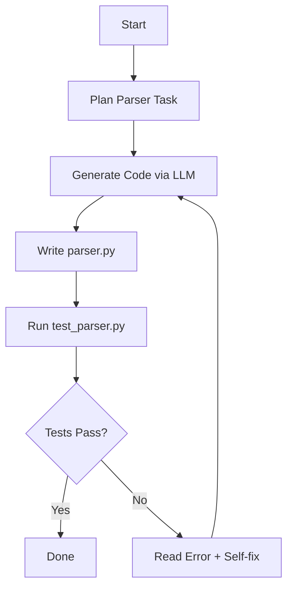

# 🧠 Agent-as-Coder Challenge

Build an LLM-powered autonomous agent that **generates a parser** for PDF bank statements (e.g., ICICI) and **self-corrects** up to 3 times based on test feedback. This project uses **LangGraph** to orchestrate the agent's reasoning cycle.

---

## 🧩 Project Structure

```
ai-agent-challenge/
├── agent.py                  # Main agent entrypoint using LangGraph
├── test_parser.py            # Auto-generated to test the parser
├── custom_parsers/
│   └── icici_parser.py       # Agent-generated parser
├── data/
│   └── icici/
│       ├── icici_sample.pdf  # Sample ICICI bank statement
│       └── icici_sample.csv  # Ground truth output
└── README.md
```

---

## 🧠 Agent Architecture



* **LangGraph** handles the loop.
* **LLM (Gemini/Groq)** powers code generation and self-debug.
* Max 3 attempts per parser generation.

---

## 🚀 Quickstart (5 Steps)

1. **Clone Repo**

   ```bash
   git clone https://github.com/YOUR_USERNAME/ai-agent-challenge.git
   cd ai-agent-challenge
   ```

2. **Install Requirements**

   ```bash
   pip install -r requirements.txt
   ```

3. **Set Environment**

   ```bash
   export GOOGLE_API_KEY=your-key  # or GROQ_API_KEY or OPENAI_API_KEY
   ```

4. **Run the Agent**

   ```bash
   python agent.py --target icici
   ```

5. **Check Output**

   * Generated parser: `custom_parsers/icici_parser.py`
   * Test results in terminal.
   * Compare `parse()` output with `icici_sample.csv`.

---

## 🧰 Tech Stack

* [LangGraph](https://www.langgraph.dev/)
* OpenAI / Gemini / Groq LLMs
* `PyMuPDF` / `pdfplumber` (for reading PDFs)
* `pandas` for CSV comparison

---
